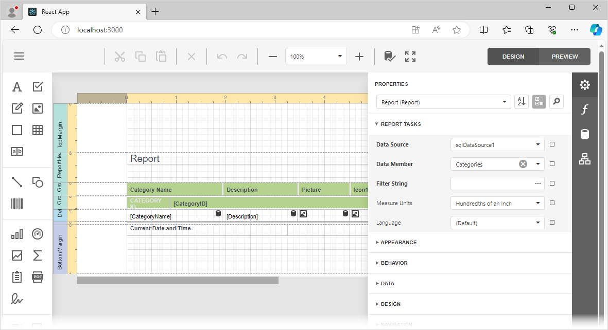

> [!TIP]
> Make sure that the backend application runs on the port specified in the host setting of the Report Designer component. For more information, refer to the following help topic: [Determine the Host URL](https://docs.devexpress.com/XtraReports/400196/web-reporting/asp-net-core-reporting/server-side-configuration/report-designer-server-side-configuration-asp-net-core#step-3-determine-the-host-url).

